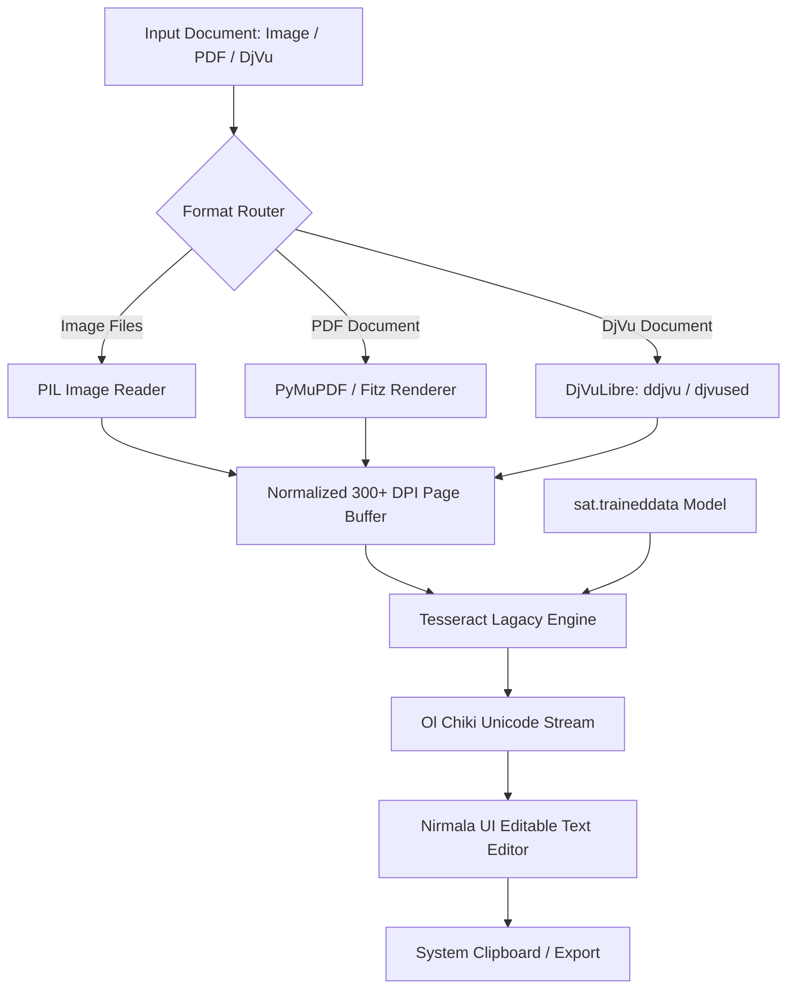

# ᱥᱟᱱᱛᱟᱲᱤ OCR

<p align="center">
  
</p>

<p align="center">
  <strong>High-accuracy, standalone, offline Optical Character Recognition (OCR) desktop application for Santali text in the Santali script (Ol Chiki).</strong>
</p>

<p align="center">
  
  
  
  
  
</p>

---

## 📖 Overview

**Santali OCR** is an offline Windows desktop software designed to digitize printed books, archival manuscripts, historical records, and documents written in the **Santali script** (Ol Chiki) (`U+1C50`–`U+1C7F`).

Equipped with a lagacy OCR engine and native decoders for images, multi-page PDFs, and DjVu files, the application converts scanned documents into editable Unicode text without sending any data to external servers.

---

## ✨ Features

- **100% Offline & Self-Contained**: No internet connection, cloud API keys, or external runtime installations required. Tesseract 5, the `sat.traineddata` model, and DjVuLibre engines are bundled directly into the executable.
- **Multi-Format Document Ingestion**:
  - **Images**: PNG, JPG, JPEG, BMP, TIFF, TIF, WebP, GIF.
  - **PDF Documents**: High-DPI page-by-page rendering and text extraction.
  - **DjVu Documents (`.djvu`, `.djv`)**: Native page extraction supporting Unicode/Santali-named files.
- **Side-by-Side OCR Studio**:
  - **Left Viewer**: Zoom-to-fit document viewport with page navigation controls (`Previous`, `Next`, page counter).
  - **Right Editor**: Real-time editable Unicode Ol Chiki output area rendered with `Nirmala UI`.
- **One-Click Actions**:
  - `1. Open Image / PDF / DjVu`
  - `2. Run Text OCR`
  - `3. Copy Text` (instant clipboard export)
- **Windows Integration**:
  - Dedicated Taskbar identity and custom AppUserModelID.
  - Native Windows Setup Wizard (`SantaliOCR_Setup.exe`) with Start Menu and Desktop shortcut creation.
  - Clean uninstallation via Windows *Settings ➔ Installed Apps*.

---

## 🖥️ System Architecture



---

## 🚀 Download & Installation

### Option 1: Full Windows Installer (Recommended)
1. Download **`SantaliOCR_Setup.exe`** from the [Latest Release](https://github.com/kbaske/SantaliOCR/releases/latest).
2. Run the installer wizard.
3. Launch **Santali OCR** from your Start Menu or Desktop shortcut.

### Option 2: Portable Standalone Executable
1. Download **`SantaliOCR.exe`**.
2. Run the executable directly — [no installation](https://github.com/kbaske/SantaliOCR/releases/pre-release) needed.

---

## 🛠️ How to Use

1. **Open Document**: Click `1. Open Image / PDF / DjVu` and select your file.
2. **Navigate Pages**: For multi-page PDFs or DjVu files, use the `◀ Prev` and `Next ▶` buttons at the top of the viewer to select a page.
3. **Recognize Text**: Click `2. Run Text OCR`. The extracted Ol Chiki characters will appear in the right-hand panel.
4. **Edit & Copy**: Make any manual adjustments directly in the editor, then click `3. Copy Text` to paste the digitized content into Word, Notepad, or web browsers.

---

## 💡 Scanning & Accuracy Tips

To achieve the best recognition accuracy:
- **Resolution**: Scan physical pages at **300 DPI or higher**.
- **Contrast**: Ensure strong black-on-white contrast with minimal background bleeding.
- **Orientation**: Align pages so text lines are horizontal (avoid skewed or rotated scans).
- **Typography**: Optimized for standard Ol Chiki glyphs including punctuation (`᱾`, `᱿`) and diacritic marks (`ᱸ`, `ᱹ`, `ᱺ`, `ᱻ`, `ᱼ`, `ᱽ`).

---

## 🔧 Building from Source

### Prerequisites
- Python 3.11+ (64-bit)
- Tesseract OCR with `sat.traineddata` placed in `C:\Program Files\Tesseract-OCR\tessdata\`

### Setup & Build
```powershell
# Clone repository
git clone https://github.com/kbaske/SantaliOCR.git
cd SantaliOCR

# Install dependencies
pip install -r requirements.txt

# Build the complete installer suite (SantaliOCR.exe, uninstall.exe, SantaliOCR_Setup.exe)
python build_all.py
```
Compiled binaries will be available in the `dist/` directory.

---

## 👨‍💻 Developer & Attribution

- **Developer**: **Professor Baskey (Karia)** (Santali Language Specialist)
- **Organization**: Santali Language Digitization Initiative
- **Contact**: `professor@santals.in` | `kariabaske@gmail.com`
- **GitHub**: [@kbaske](https://github.com/kbaske)

### Supporting Organizations & Affiliates
- **ᱥᱟᱱᱛᱟᱲ - The Santals** — Preservation and digital archiving of tribal literature.
- **ᱛᱚᱞᱜᱤᱨᱟᱹ - Santali Lyrics** — Unicode typography and keyboard layout standards.
- **Santali Language Digitization Initiative** — Customized OCR model training and linguistic parsing.

---

## 📄 License

Distributed under the **GNU General Public License v2.0 (GPL-2.0)**. See `LICENSE` for details.
